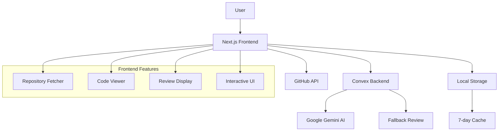

# 🚀 AI Agent Code Review - Complete Beginner's Guide

## 📖 Table of Contents
1. [What is AI Agent Code Review?](#what-is-ai-agent-code-review)
2. [Tech Stack Overview](#tech-stack-overview)
3. [Getting Started](#getting-started)
4. [Application Architecture](#application-architecture)
5. [Features Deep Dive](#features-deep-dive)
6. [File Structure Guide](#file-structure-guide)
7. [API Reference](#api-reference)
8. [Component Library](#component-library)
9. [Development Workflow](#development-workflow)
10. [Deployment Guide](#deployment-guide)

## 🤖 What is AI Agent Code Review?

AI Agent Code Review is a modern web application that provides **automated code reviews using Google's Gemini AI**. It helps developers improve code quality by analyzing GitHub repositories and providing detailed feedback on:

- **Code Quality** - Organization, readability, maintainability
- **Bug Detection** - Logic errors, edge cases, runtime issues
- **Performance** - Bottlenecks and optimization opportunities
- **Security** - Vulnerabilities and best practices
- **Best Practices** - Language-specific recommendations

### 🌟 Key Features
- **GitHub Integration** - Fetch any public repository
- **AI-Powered Analysis** - Google Gemini 1.5 Pro model
- **Interactive UI** - Click on highlighted lines for detailed feedback
- **Real-time Processing** - No database needed, instant results
- **Responsive Design** - Works on all devices
- **Dark/Light Mode** - System preference detection

## 🛠 Tech Stack Overview

### Frontend
- **Next.js 15** - React framework with App Router
- **React 19** - Latest React features
- **TypeScript** - Type safety and developer experience
- **Tailwind CSS** - Utility-first styling
- **Framer Motion** - Smooth animations
- **Radix UI** - Accessible component primitives

### Backend & AI
- **Convex** - Real-time backend platform
- **Google Gemini AI** - Advanced language model
- **GitHub API** - Repository data fetching
- **Zod** - Runtime type validation

### Development Tools
- **ESLint** - Code linting
- **Turbopack** - Fast development builds
- **TypeScript** - Static type checking

## 🚀 Getting Started

### Prerequisites
- **Node.js 18+** (LTS recommended)
- **Google Gemini API Key** ([Get one here](https://ai.google.dev/))
- **Convex Account** ([Sign up here](https://convex.dev/))

### Installation Steps

1. **Clone the Repository**
   ```bash
   git clone https://github.com/kulkarniankita/ai-agent-code-review
   cd ai-agent-code-review
   ```

2. **Install Dependencies**
   ```bash
   npm install
   ```

3. **Set Up Environment Variables**
   ```bash
   # Create .env.local file
   GOOGLE_GENERATIVE_AI_API_KEY=your_gemini_api_key
   # Alternative key name also supported:
   # GEMINI_API_KEY=your_gemini_api_key
   ```

4. **Initialize Convex**
   ```bash
   npx convex dev
   ```
   This will:
   - Create a new Convex project (if first time)
   - Generate Convex configuration
   - Start the development server

5. **Start Development Server**
   ```bash
   npm run dev
   ```

6. **Open Application**
   Navigate to `http://localhost:3000`

## 🏗 Application Architecture



### Data Flow

1. **Repository Input** - User enters GitHub URL
2. **GitHub Fetch** - API retrieves repository files
3. **Local Caching** - Files stored for 7 days
4. **AI Processing** - Convex sends code to Gemini
5. **Review Display** - Interactive results with line highlighting

## 🎯 Features Deep Dive

### 1. Repository Fetcher (`/code`)
```typescript
// Located in: app/code/page.tsx
```
- **Input Formats**: 
  - `github.com/owner/repo`
  - `owner/repo`
- **File Filtering**: Excludes large files, configs, node_modules
- **Smart Caching**: 7-day localStorage persistence
- **Progress Tracking**: Real-time fetch status

### 2. Code Review Interface (`/codereview`)
```typescript
// Located in: app/codereview/page.tsx
```
- **3-Panel Layout**: Files | Code Viewer | Review Panel
- **Resizable Panels**: Drag to adjust widths
- **Syntax Highlighting**: Language-specific coloring
- **Interactive Lines**: Click highlighted lines for details

### 3. AI Processing
```typescript
// Located in: convex/agent.ts
```
- **Primary AI**: Google Gemini 1.5 Pro
- **Fallback System**: Basic pattern-based reviews
- **Real-time Processing**: No database storage
- **Error Handling**: Graceful degradation

### 4. Visual Effects
- **Hero Grid**: 3D animated background
- **Particle System**: Mouse-interactive effects
- **Smooth Animations**: Framer Motion powered
- **Theme System**: Auto-detecting dark/light mode

## 📁 File Structure Guide

```
ai-agent-code-review/
├── app/                          # Next.js App Router
│   ├── api/                      # API Routes
│   │   ├── files/route.ts        # File handling (client storage)
│   │   └── review/route.ts       # Gemini AI integration
│   ├── code/page.tsx             # Repository input page
│   ├── codereview/page.tsx       # Review interface
│   ├── layout.tsx                # Root layout
│   ├── page.tsx                  # Landing page
│   └── globals.css               # Global styles
├── components/                   # React Components
│   ├── ui/                       # Reusable UI components
│   │   ├── button.tsx            # Button variants
│   │   ├── card.tsx              # Card layouts
│   │   ├── dialog.tsx            # Modal dialogs
│   │   └── ...                   # Other UI primitives
│   ├── code-review.tsx           # Review display
│   ├── file-content.tsx          # Code viewer
│   ├── navbar.tsx                # Navigation
│   ├── review-client.tsx         # Main review interface
│   └── ...                       # Feature components
├── convex/                       # Backend Functions
│   ├── agent.ts                  # AI integration
│   ├── fallbackReview.ts         # Fallback logic
│   └── convex.config.ts          # Convex setup
├── lib/                          # Utilities
│   └── utils.ts                  # Helper functions
└── public/                       # Static assets
    ├── fonts/                    # Geist font family
    └── *.svg                     # Icons and graphics
```

## 🔌 API Reference

### Repository Fetching
```typescript
// GitHub API Integration
const fetchRepository = async (owner: string, repo: string) => {
  const response = await fetch(`https://api.github.com/repos/${owner}/${repo}/contents`);
  // Recursive file fetching with filtering
};
```

### Code Review API
```typescript
// POST /api/review
{
  "filename": "example.tsx",
  "code": "const component = () => { return <div>Hello</div>; };"
}

// Response
{
  "review": "# Code Review for example.tsx\n\n## Overview...",
  "isFallback": false
}
```

### Convex Actions
```typescript
// convex/agent.ts
export const createCodeReviewThread = action({
  args: { prompt: v.string(), code: v.string() },
  handler: async (ctx, args) => {
    // Gemini AI integration
    const result = await thread.generateText({
      prompt: `${prompt}\n\nCode:\n\`\`\`\n${code}\n\`\`\``
    });
    return { threadId, text: result.text };
  }
});
```

## 🧩 Component Library

### UI Components (`components/ui/`)

#### Button Component
```typescript
// Variants: default, destructive, outline, secondary, ghost, link
// Sizes: default, sm, lg, icon
<Button variant="default" size="lg">Get Started</Button>
```

#### Card Component
```typescript
<Card>
  <CardHeader>
    <CardTitle>File Content</CardTitle>
  </CardHeader>
  <CardContent>
    {/* Content here */}
  </CardContent>
</Card>
```

#### Dialog Component
```typescript
<Dialog open={showDialog} onOpenChange={setShowDialog}>
  <DialogContent>
    <DialogHeader>
      <DialogTitle>Line Details</DialogTitle>
    </DialogHeader>
    {/* Dialog content */}
  </DialogContent>
</Dialog>
```

### Feature Components

#### Code Viewer
```typescript
// components/file-content.tsx
<FileContent
  selectedFile="example.tsx"
  fileContent={code}
  highlightedLines={[1, 5, 10]}
  lineComments={{ 1: "This line has an issue" }}
  onLineClick={(line, e) => showDetails(line)}
/>
```

#### Review Display
```typescript
// components/code-review.tsx
<CodeReview
  review={aiReview}
  isLoading={false}
  onRefresh={() => triggerNewReview()}
/>
```

## 💻 Development Workflow

### Daily Development Commands
```bash
# Start development
npm run dev          # Next.js dev server
npx convex dev       # Convex backend

# Code quality
npm run lint         # ESLint checking
npm run build        # Production build
```

### Adding New Features

1. **UI Components**: Create in `components/ui/`
2. **Feature Components**: Create in `components/`
3. **API Routes**: Add to `app/api/`
4. **Backend Functions**: Add to `convex/`
5. **Pages**: Add to `app/`

### Code Style Guidelines
- **TypeScript**: Strict typing required
- **Imports**: Use `@/` path aliases
- **Components**: Functional with explicit interfaces
- **Styling**: Tailwind CSS classes
- **State**: React hooks for local state

## 🚀 Deployment Guide

### Environment Variables
```bash
# Production environment
GOOGLE_GENERATIVE_AI_API_KEY=your_api_key
CONVEX_DEPLOYMENT=your_convex_deployment_url
```

### Deployment Platforms

#### Vercel (Recommended)
1. Connect GitHub repository
2. Add environment variables
3. Deploy automatically on push

#### Netlify
1. Build command: `npm run build`
2. Publish directory: `.next`
3. Add environment variables

#### Self-Hosted
```bash
npm run build        # Build for production
npm start           # Start production server
```

### Convex Deployment
```bash
npx convex deploy    # Deploy backend functions
```

## 🔧 Troubleshooting

### Common Issues

1. **API Key Errors**
   - Verify `GOOGLE_GENERATIVE_AI_API_KEY` is set
   - Check API key permissions

2. **Convex Connection**
   - Run `npx convex dev` first
   - Check Convex dashboard for errors

3. **GitHub Rate Limits**
   - Use authenticated requests for higher limits
   - Implement caching (already included)

4. **Build Errors**
   - Check TypeScript errors: `npm run build`
   - Verify all imports are correct

### Getting Help
- **Documentation**: [Next.js Docs](https://nextjs.org/docs)
- **Convex**: [Convex Docs](https://docs.convex.dev/)
- **GitHub Issues**: Report bugs in the repository

## 📚 Next Steps

1. **Customize AI Prompts**: Modify `convex/agent.ts`
2. **Add New Languages**: Extend language detection
3. **Enhanced UI**: Add more interactive features
4. **Analytics**: Track usage patterns
5. **User Accounts**: Add authentication
6. **Team Features**: Collaborative reviews

---

**Happy Coding! 🎉** This guide should get you started with AI Agent Code Review. For more advanced customization, dive into the source code and explore the component implementations.