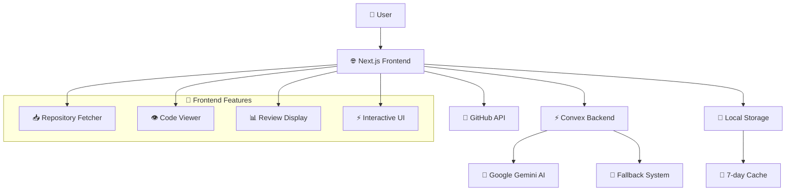

# 🤖 AI Agent Code Review

An advanced AI-powered code review platform that leverages **Google Gemini 1.5 Pro** to provide comprehensive code analysis. Built with modern web technologies for developers who want to improve code quality, catch bugs early, and follow best practices.

   

## ✨ Features

### 🚀 Core Functionality
- **GitHub Integration** - Fetch and analyze any public repository
- **AI-Powered Reviews** - Google Gemini 1.5 Pro provides expert-level feedback
- **Interactive Code Viewer** - Syntax highlighting with clickable line comments
- **Real-time Processing** - Instant analysis without database dependencies
- **Smart Caching** - 7-day localStorage cache for faster re-visits

### 🎨 User Experience
- **Responsive Design** - Works seamlessly on desktop, tablet, and mobile
- **Dark/Light Mode** - Automatic theme detection with manual toggle
- **Smooth Animations** - Framer Motion powered transitions
- **3D Visual Effects** - Interactive background elements

### 🔧 Developer Features
- **Multiple AI Models** - Fallback system ensures reliability
- **TypeScript First** - Full type safety throughout the application
- **Component Library** - Reusable UI components built on Radix UI
- **Modern Architecture** - Next.js 15 with App Router

## 🛠 Tech Stack

### Frontend Architecture
- **[Next.js 15](https://nextjs.org/)** - React framework with App Router
- **[React 19](https://react.dev/)** - Latest React features and optimizations
- **[TypeScript 5](https://www.typescriptlang.org/)** - Type safety and developer experience
- **[Tailwind CSS 4](https://tailwindcss.com/)** - Utility-first styling framework
- **[Framer Motion](https://www.framer.com/motion/)** - Smooth animations and interactions

### Backend & AI
- **[Convex](https://convex.dev/)** - Real-time backend platform
- **[Google Gemini AI](https://ai.google.dev/)** - Advanced language model for code analysis
- **[GitHub API](https://docs.github.com/en/rest)** - Repository data fetching
- **[Zod](https://zod.dev/)** - Runtime type validation

### UI Components
- **[Radix UI](https://www.radix-ui.com/)** - Accessible component primitives
- **[React Syntax Highlighter](https://github.com/react-syntax-highlighter/react-syntax-highlighter)** - Code syntax highlighting
- **[Lucide React](https://lucide.dev/)** - Beautiful icon library

## 🚀 Quick Start

### Prerequisites
- **Node.js 18+** (LTS recommended)
- **Google Gemini API Key** - [Get yours here](https://ai.google.dev/)
- **Convex Account** - [Sign up free](https://convex.dev/)

### Installation

1. **Clone and install**
   ```bash
   git clone https://github.com/gauravxdev/CodeReviewAgent.git
   cd ai-agent-code-review
   npm install
   ```

2. **Set up environment variables**
   ```bash
   # Create .env.local
   GOOGLE_GENERATIVE_AI_API_KEY=your_gemini_api_key_here
   ```

3. **Initialize Convex backend**
   ```bash
   npx convex dev
   ```

4. **Start development server**
   ```bash
   npm run dev
   ```

5. **Open your browser**
   Navigate to `http://localhost:3000`

## 📱 How It Works

### 1. Repository Input (`/code`)
- Enter any GitHub repository URL (e.g., `facebook/react`)
- Supports both full URLs and owner/repo format
- Smart filtering excludes large files and config directories
- Files cached locally for 7 days

### 2. Code Analysis (`/codereview`)
- **Three-panel interface**: File list | Code viewer | AI review
- **Resizable panels** for optimal viewing
- **Interactive highlighting** - click on highlighted lines for detailed feedback
- **Syntax highlighting** for 20+ programming languages

### 3. AI Processing
- **Primary**: Google Gemini 1.5 Pro for comprehensive analysis
- **Fallback**: Pattern-based review system for reliability
- **Real-time**: No database storage, instant results
- **Smart prompting**: Context-aware analysis based on file type

## 🏗 Architecture Overview



## 📁 Project Structure

```
ai-agent-code-review/
├── 📱 app/                       # Next.js App Router
│   ├── 🔌 api/                   # API endpoints
│   ├── 📝 code/page.tsx          # Repository input
│   ├── 🔍 codereview/page.tsx    # Review interface
│   └── 🏠 page.tsx               # Landing page
├── 🧩 components/                # React components
│   ├── 🎨 ui/                    # Reusable UI library
│   ├── 📄 code-review.tsx        # Review display
│   ├── 👁️ file-content.tsx       # Code viewer
│   └── 🖥️ review-client.tsx      # Main interface
├── ⚡ convex/                    # Backend functions
│   ├── 🤖 agent.ts               # AI integration
│   └── 🔄 fallbackReview.ts      # Backup system
└── 🎨 components/ui/             # Component library
    ├── 🔘 button.tsx             # Button variants
    ├── 📋 card.tsx               # Card layouts
    └── 💬 dialog.tsx             # Modal dialogs
```

## 🚀 Development

### Available Commands
```bash
# Development
npm run dev          # Start dev server with Turbopack
npx convex dev       # Start Convex backend

# Production
npm run build        # Build for production
npm run start        # Start production server

# Code Quality
npm run lint         # Run ESLint
```

### Adding Features

1. **UI Components** → `components/ui/`
2. **Feature Components** → `components/`
3. **API Routes** → `app/api/`
4. **Backend Logic** → `convex/`
5. **New Pages** → `app/`

### Code Style
- **TypeScript** strict mode with explicit typing
- **ESLint** with Next.js and TypeScript rules
- **Tailwind CSS** for styling with custom design tokens
- **Path aliases** using `@/` prefix
- **Functional components** with hooks

## 🔧 Configuration

### Environment Variables
```bash
# Required
CONVEX_DEPLOYMENT=your-convex-deployment-url
NEXT_PUBLIC_CONVEX_URL=https://your-convex-url.convex.cloud
GOOGLE_GENERATIVE_AI_API_KEY=your-google-gemini-api-key
GEMINI_API_KEY=your-gemini-api-key
NEXT_PUBLIC_GITHUB_TOKEN=your-github-token
NEXT_PUBLIC_CLERK_PUBLISHABLE_KEY=your-clerk-publishable-key
CLERK_SECRET_KEY=your-clerk-secret-key
```

### Supported Languages
The AI can review code in 20+ languages including:
- JavaScript/TypeScript
- Python, Java, C++
- Go, Rust, Swift
- HTML/CSS, SQL
- And many more...

## 🚀 Deployment

### Vercel (Recommended)
[](https://vercel.com/new/clone?repository-url=https://github.com/gauravxdev/CodeReviewAgent)

1. Connect your GitHub repository
2. Add environment variables
3. Deploy automatically

### Other Platforms
- **Netlify**: Build command `npm run build`, publish `.next`
- **Railway**: Add `GOOGLE_GENERATIVE_AI_API_KEY`
- **Self-hosted**: Use `npm run build && npm start`

Don't forget to deploy your Convex backend:
```bash
npx convex deploy
```

## 🤝 Contributing

We welcome contributions! Here's how to get started:

1. **Fork the repository**
2. **Create a feature branch**: `git checkout -b feature/amazing-feature`
3. **Make your changes** following the code style guidelines
4. **Test thoroughly** with `npm run build`
5. **Submit a pull request**

### Development Guidelines
- Follow TypeScript strict mode
- Add proper type definitions
- Include JSDoc comments for complex functions
- Test on multiple screen sizes
- Ensure accessibility compliance

## 📖 Documentation

- 📚 **[Beginner's Guide](./BEGINNERS_GUIDE.md)** - Complete setup and development guide
- 🔧 **[AGENT.md](./AGENT.md)** - Development commands and coding standards
- 🎨 **[Component Library](./components/)** - UI component documentation

## 🐛 Troubleshooting

### Common Issues

**API Key Problems**
```bash
# Verify your environment variables
echo $GOOGLE_GENERATIVE_AI_API_KEY
```

**Convex Connection Issues**
```bash
# Restart Convex development server
npx convex dev --clear
```

**Build Errors**
```bash
# Check TypeScript errors
npm run build
# Fix linting issues
npm run lint
```

## 📄 License

This project is licensed under the **MIT License**. See [LICENSE](./LICENSE) for details.

## 🙏 Acknowledgments

- **Google AI** for the Gemini API
- **Convex** for the amazing backend platform
- **Vercel** for Next.js and deployment
- **Radix UI** for accessible components
- **Tailwind CSS** for the styling system

## 📞 Support

- 🐛 **Bug Reports**: [GitHub Issues](https://github.com/gauravxdev/CodeReviewAgent/issues)
- 📧 **Contact**: Open an issue for support

---

**Made with ❤️ for developers who care about code quality**

⭐ **Star this repo** if you find it helpful!
